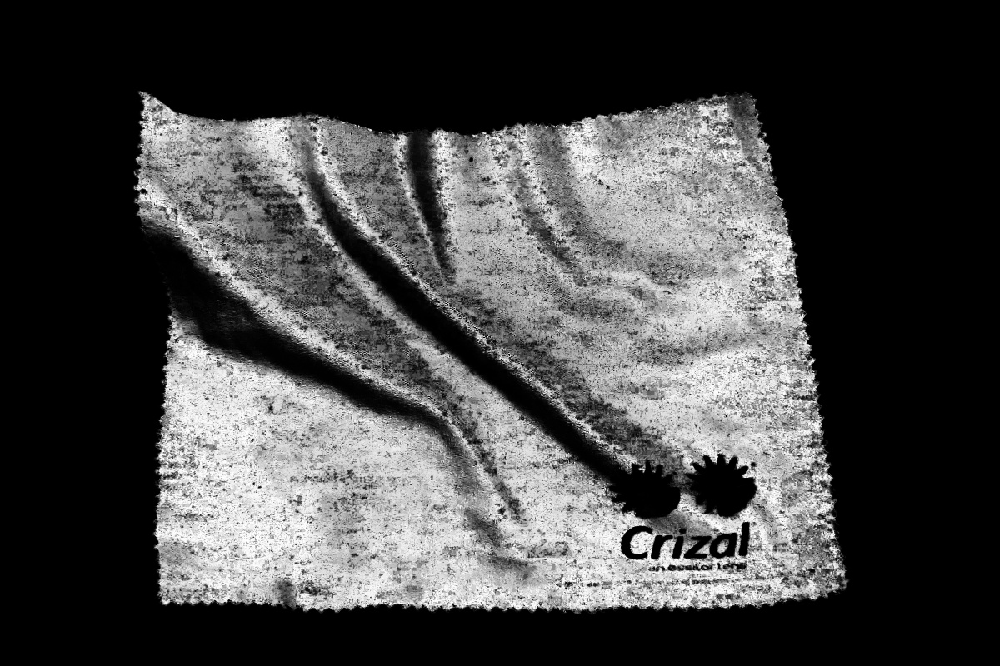
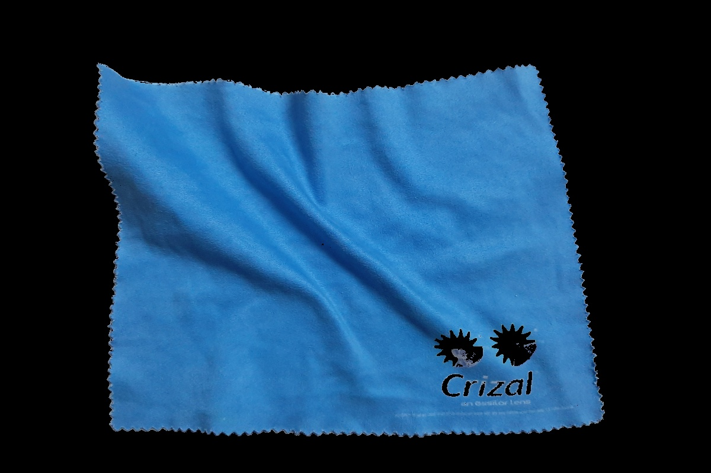

# Steps to run the code
`python segment_blue_foreground.py`

# Input image
`sample.jpg`

# Roughly segmented image using GMM
`roughly_segmented_foreground.jpg`

# Probability map
`probability_map.jpg`

# Output [Finely segmented foreground]
`finely_segmented_foreground.jpg`

