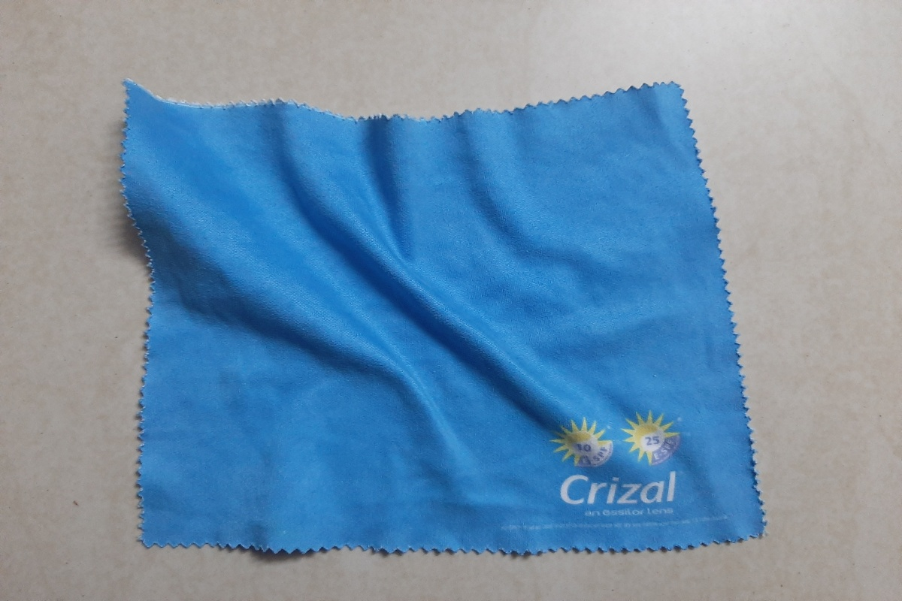
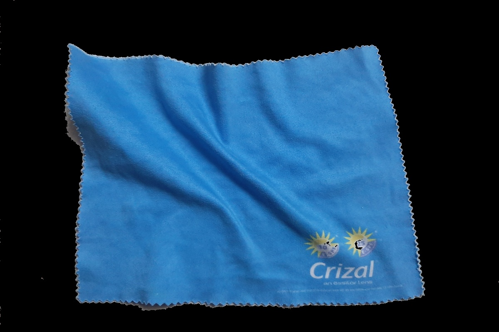

# Steps to run the code
`python segment_blue_foreground.py`

# Input image
`sample.jpg`

# Output
`finely_segmented_foreground.jpg`

# Roughly segmnented image using GMM
`roughly_segmented_foreground.jpg`

